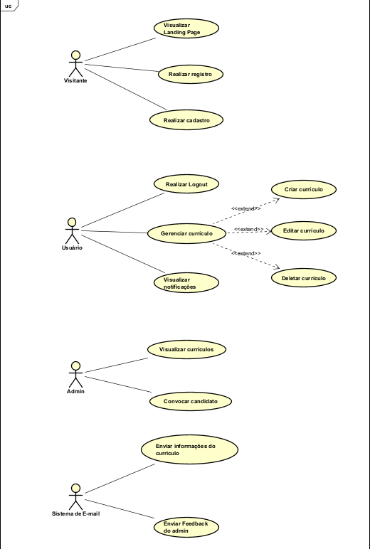

# 📘 Diagrama de Caso de Uso - Sistema de Cadastro de Currículos

## 🎯 Visão Geral
O sistema de **Cadastro de Currículos** tem como objetivo permitir que candidatos enviem seus currículos por meio de um formulário web.  
Os dados são validados, armazenados em banco de dados, e enviados também para o administrador. Além disso, o sistema registra o **IP, data e hora** da submissão.

### Atores
- **Candidato**: preenche e envia o formulário de currículo.
- **Administrador**: consulta os currículos recebidos.
- **Sistema de E-mail**: serviço externo responsável pelo envio do e-mail com os dados e currículo anexado e feeedback.

---

