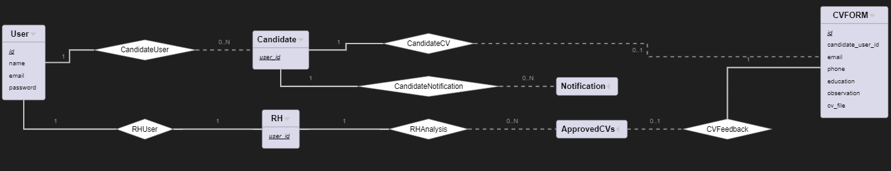
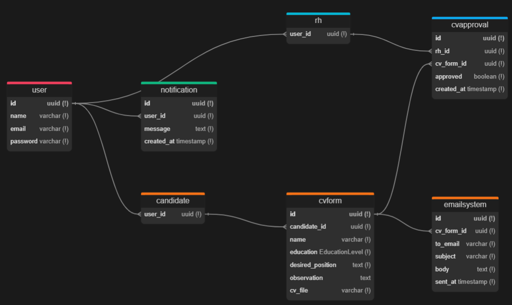

# Modelo de Banco de Dados

## Diagrama ER

## Modelo Relacional

## Dicionário de Dados

--- 
**Tabela** : user

*Descrição* : Tabela que contem as informações do usuário.

| Colunas | Descrição | Tipo de Dado | Tamanho | Null | PK | FK | Unique | Identity | Default |
| ------- | --------- | ------------ | ------- | ---- | -- | -- | ------ | -------- | ------- |
| id | chave primária | UUID |  | &#9744;  | &#9745; | &#9744; | &#9745; | &#9745; |  |  | 
| name | Nome do dono da conta | Varchar | 255 | &#9744;  | &#9744; | &#9744; | &#9744; | &#9744; |  | 
| password | Senha | Varchar | 255 | &#9744;  | &#9744; | &#9744; | &#9744; | &#9744; |  |  | 
| email | Email do usuário | Varchar | 255 | &#9744;  | &#9744; | &#9744; | &#9745; | &#9744; |  |   
| avatar_url | Link para a foto do usuário | Varchar | 255 | &#9745;  | &#9744; | &#9744; | &#9744; | &#9744; |  |  
 

--- 
**Tabela** : candidates

*Descrição* : Tabela que contém o usuários candidatos.

| Colunas | Descrição | Tipo de Dado | Tamanho | Null | PK | FK | Unique | Identity | Default | 
| ------- | --------- | ------------ | ------- | ---- | -- | -- | ------ | -------- | ------- |
| user_id | Id do usuário | UUID |  | &#9744;  | &#9744; | &#9745; | &#9745; | &#9745; |  |  | 

--- 

--- 
**Tabela** : rh

*Descrição* : Tabela que contém o usuário do rh da empresa acessado com suas credenciais.

| Colunas | Descrição | Tipo de Dado | Tamanho | Null | PK | FK | Unique | Identity | Default |  
| ------- | --------- | ------------ | ------- | ---- | -- | -- | ------ | -------- | ------- |
| user_id | Id do usuário | UUID |  | &#9744;  | &#9744; | &#9745; | &#9745; | &#9745; |  |  | 

--- 
**Tabela** : cvform

*Descrição* : Tabela que contém as tarefas individuais de usuários.

| Colunas | Descrição | Tipo de Dado | Tamanho | Null | PK | FK | Unique | Identity | Default |
| ------- | --------- | ------------ | ------- | ---- | -- | -- | ------ | -------- | ------- |
| id | chave primária | UUID |  | &#9744;  | &#9745; | &#9744; | &#9745; | &#9745; |  |  | 
| candidate_id | chave estrangeira, Id do candidato | UUID |  | &#9744;  | &#9744; | &#9745; | &#9745; | &#9744; |  | 
| email | Email para contato | varchar | 255 | &#9744;  | &#9744; | &#9745; | &#9744; | &#9744; |  |  
| phone | Telefone para contato | UUID | 20 | &#9744;  | &#9744; | &#9744; | &#9744; | &#9744; |  | 
| education | Formação acadêmica | ENUM |  | &#9744;  | &#9744; | &#9744; | &#9744; | &#9744; |  | 
| observation | Observações do candidato | 255 |  | &#9745;  | &#9744; | &#9744; | &#9744; | &#9744; |  | 
| desired_position | Cargo desejado | UUID | 25 | &#9744;  | &#9744; | &#9744; | &#9744; | &#9744; |  | 
| created_at | Data de criação | Timestamp | | &#9744;  | &#9744; | &#9744; | &#9744; | &#9744; | `now()` |  

--- 
**Tabela** : cvapproval

*Descrição* : Tabela que representa a aprovação de currículos pelo RH.

| Colunas | Descrição | Tipo de Dado | Tamanho | Null | PK | FK | Unique | Identity | Default | 
| ------- | --------- | ------------ | ------- | ---- | -- | -- | ------ | -------- | ------- | 
| id | chave primária | UUID |  | &#9744;  | &#9745; | &#9744; | &#9745; | &#9744; |  |  | 
| rh_id | chave estrangeira, Id do RH | UUID |  | &#9744;  | &#9744; | &#9745; | &#9745; | &#9744; |  |  | 
| cv_form_id | chave estrangeira, Id do cv | UUID |  | &#9744;  | &#9744; | &#9745; | &#9745; | &#9744; |  |  | 
| is_approved | Define se o cv foi aprovado ou não | boolean | | &#9744;  | &#9744; | &#9744; | &#9744; | &#9744; | false |  
| created_at | Data de aprovação | Date |  | &#9744;  | &#9744; | &#9744; | &#9744; | &#9744; | now() | 

---

**Tabela** : emailsystem

*Descrição* : Tabela que representa o sistema de envios de e-mails automáticos.

| Colunas | Descrição | Tipo de Dado | Tamanho | Null | PK | FK | Unique | Identity | Default | 
| ------- | --------- | ------------ | ------- | ---- | -- | -- | ------ | -------- | ------- | 
| id | chave primária | UUID |  | &#9744;  | &#9745; | &#9744; | &#9745; | &#9745; |  |  | 
| cv_form_id | chave estrangeira, Id do cv | UUID |  | &#9744;  | &#9744; | &#9745; | &#9745; | &#9744; |  |  | 
| to_email | email do candidato do cv aprovado | Varchar | | &#9744;  | &#9744; | &#9744; | &#9744; | &#9744; |  | 
| subject | tema do email | Varchar | | &#9744;  | &#9744; | &#9744; | &#9744; | &#9744; |  | 
| body | contexto do email | Varchar | | &#9744;  | &#9744; | &#9744; | &#9744; | &#9744; |  | 
| sent_at | Data de criação da competição | Timestamp |  | &#9744;  | &#9744; | &#9744; | &#9744; | &#9744; | now() |  

---

**Tabela** : notification

*Descrição* : Tabela que representa a relação many-to-many entre "group_participant" e "competition".

| Colunas | Descrição | Tipo de Dado | Tamanho | Null | PK | FK | Unique | Identity | Default | 
| ------- | --------- | ------------ | ------- | ---- | -- | -- | ------ | -------- | ------- | 
| id | chave primária | UUID |  | &#9744;  | &#9745; | &#9744; | &#9745; | &#9744; |  |  | 
| user_id | chave estrangeira, Id do usuário que recebeu uma notificação | UUID |  | &#9744;  | &#9744; | &#9745; | &#9745; | &#9744; |  |  |  
| message | mensagem que da contexto a notificação | VARCHAR |  | &#9744;  | &#9744; | &#9744; | &#9744; | &#9744; | 0 |  
| created_at | Data de criação da competição | Timestamp |  | &#9744;  | &#9744; | &#9744; | &#9744; | &#9744; | now() |  
