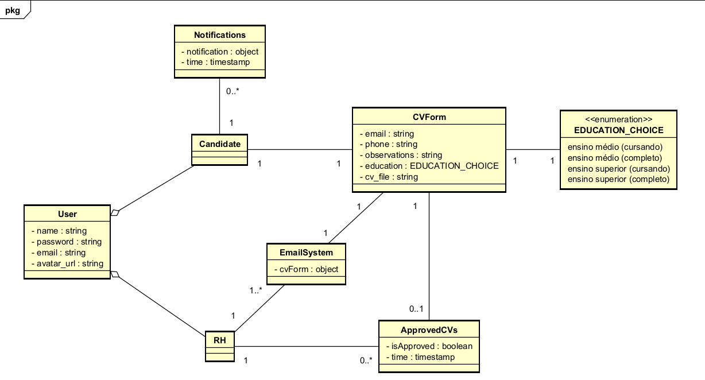

# 📘 Diagrama de Classes — Sistema de Gerenciamento de Currículos

## 🎯 Visão Geral
Este diagrama de classes representa as principais entidades envolvidas no sistema de gerenciamento de currículos. Ele modela as responsabilidades de cada classe, seus atributos e tipos e os relacionamentos entre elas.

---

## 🧩 Entidades e Definições

### 1. `User`
Representa um usuário não autenticado que pode visualizar a landing page e realizar registro.

**Atributos:**
- `name: String`
- `email: String`
- `password: String`
- `avatar_url: String`

### 2. `Candidate` _(herda de User)_
Usuário autenticado que pode gerenciar seu currículo e visualizar notificações.

**Atributos:**
    - _(herda de User)_

---

### 3. `CVForm`
Documento criado pelo usuário contendo suas informações profissionais.

**Atributos:**
- `email: String`
- `phone: String`
- `observations: String`
- `cv_file: String`

--

### 4. `RH`  _(herda de User)_
RH autenticado no sistema que pode visualizar currículos e aprovar candidatos.

**Atributos:**
- _(herda de User)_

### 5. `ApprovedCV`
Tabela que registra a confirmação de interesse do RH sobre um currículo.

**Atributos:**
- `rh_id: Int`
- `CV_id: Int`
- `isApproved: Boolean`
- `time: TimeStamp`

---

### 6. `EmailSystem`
Registro de e-mails disparados automaticamente após aprovação de currículo.

**Atributos:**
- `id: Int`
- `CV_id: Int`
- `rh_id: Int`
- `CV: object`

---

## 🔗 Relacionamentos

- `Candidate` herda de `User`.
- `RH` herda de `User`.
- `Candidate` possui um ou nenhum `CV`.
- `RH` confirma `CV` via `ApprovedCV`, podendo ser 0 ou nenhum.
- `EmailSystem` depende de `CVForm` para enviar as informações a `RH`, sendo um relacionamento 1 para 1
- `Notifications` depende de `ApprovedCV` para recebimento da notificaação de aprovação ou rejeição do candidato, sendo um candidato para nenhuma ou várias notificações, relacionamento (1-1).

---

